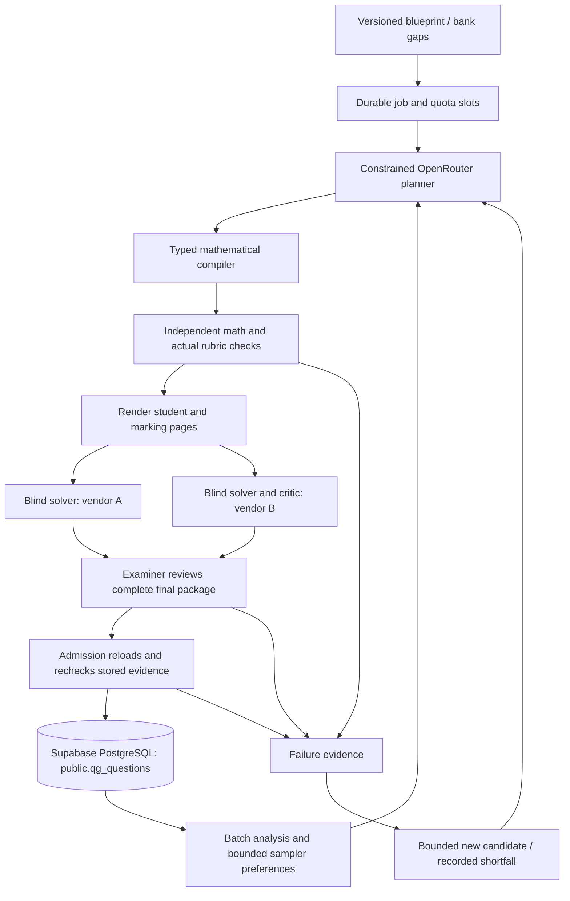

# Independent question-generation implementation

Implementation: [`question_generation/`](../question_generation/README.md), updated 13 September 2026 for Supabase-only persistence. This document describes the separate worker, not the earlier `generation/` package. The [original framework](Offline_Question_Generation_Framework.md) remains an architectural proposal; the implementation scope and departures are explicit below.

## Runtime architecture



Agents are separate structured calls, not processes with arbitrary tools. The compiler, verifier, renderer, resource ledger and bank writer are ordinary trusted Python. Every durable transition, response, evaluation and question is stored in Supabase PostgreSQL. The worker does not depend on LangGraph or copy the legacy implementation.

The mathematical specification is authoritative. Each implemented program combines a bounded parameter constructor, original stem and linked prompts, reference derivation, answer forms, M/A/B marking criteria, actual response fixtures and optional geometry. OpenRouter cannot supply arbitrary Python, change accepted curriculum IDs or edit a reference solution after verification.

Before the planner call, `planning.py` constructs six reproducible candidate previews, spanning three variants and two parameter samples each. The attempt ID determines this portfolio so a resumed request remains identical. The planner sees the complete student wording and mark allocations and selects an offered seed/variant with a rationale. Both the provider boundary and admission enforce membership in that portfolio. This makes planning an informed choice over actual mathematical tasks, not an instruction to invent an unchecked answer or a blind random seed.

## Immutable question package

`Item` in `domain.py` contains:

- Curriculum, policy/compiler/program versions, level, subject level, subject, topic, objectives and intended difficulty.
- Deterministic seed, variant and exact parameter values.
- Student stem and parts, marks, canonical answers, units, acceptable forms and tolerances.
- Worked solution steps, method restrictions, criterion dependencies and follow-through formulas.
- Six kinds of executable response fixture plus per-criterion negative mutations.
- Figure JSON with points, segments, labels, right angles and parallel relations.
- Estimated completion time and the source-style provenance label.

The verification SHA-256 covers **every field**, including prose, rubric, metadata, diagrams and fixtures. A separate mathematical identity hashes the program and exact parameters so a new seed or context name cannot duplicate an existing mathematical instance. This is exact instance deduplication; it is not a semantic-near-duplicate detector across different programs. Blueprint program quotas address one aspect of bank diversity.

Geometry is stored as JSONB inside the question package in Supabase. The renderer derives SVG and generates student/marking pages and vision-model PNGs in RAM. It never writes PDFs, SVGs, images, HTML or JSON files to disk. There is no object-storage bucket or persistent render cache. The stored mathematical package is sufficient to regenerate these representations for future backend delivery.

`student_view()` excludes solutions, rubrics, parameters and raw construction coordinates. Blind solvers get this projection, required answer formats/method codes and the exact rendered page. They do not see either the reference derivation or the other solver's response. The examiner subsequently receives both blind responses and the final package.

## Admission requirements

`admit(store, attempt_id)` is the only production insertion path in the package. It reloads the attempt and successful call records; it does not accept caller-supplied approval flags or validation reports.

1. The attempt belongs to a live OpenRouter job and an unfilled allocation. Its compiler fingerprint, curriculum and requested difficulty match.
2. Recompiling its program, seed, variant and difficulty reproduces the **complete** stored package.
3. A separately implemented oracle agrees with every mathematical criterion and final answer. Examples include brute-force transaction solutions, independent coefficient arithmetic, expanded midpoint populations, reverse equation solving and shoelace area calculations.
4. Actual structured working receives the expected marks. Corrupting any criterion loses credit. Method restrictions, explanation marks and computed follow-through are exercised.
5. Geometric relations are valid. Both student and marking pages fit A4 at a bounded minimum text scale; required images exist in the PDF.
6. Both blind solves provide every requested part, equivalent complete answers, working, acceptable methods and no unresolved ambiguities. The providers differ by model vendor.
7. The examiner supplies every required review dimension, agrees with requested demand and reports no major or critical defect. A malformed, truncated, missing or failed response never counts as approval.
8. The current worker still owns the lease, the deadline and accounting checks pass, the program is not quarantined, and unique constraints reject repeated mathematical instances. Bank insertion and slot completion commit atomically.

Only deterministic compiler defects quarantine a program version. Model disagreement, duplicates, provider outages and unfinished quotas are candidate/job outcomes, not evidence that a mathematical constructor is defective.

Reasoning fixtures validate controlled propositions. They do not establish a general natural-language theorem prover. Correctness of free-form explanatory wording is additionally reviewed by models; independent model agreement is not a proof of all claims. Source recompilation prevents an unverified edit from inheriting stale evidence.

## Durable execution and budgets

Each slot has a bounded sequence of durable attempts. A typical successful attempt progresses through:

```text
created → designed → compiled → solved_solver → solved_critic → reviewed → admitted
```

Other outcomes are `rejected`, `inconclusive` and `preview`. Final job reports retain admitted counts, shortfalls, attempt states, tokens, cost and stop reason. A budget stop preserves the last completed stage.

Before each paid request, the ledger reserves a conservative input/image/output token bound and a cost bound at configured provider price ceilings. Reservations serialize on the job row. Real reported usage replaces the reservation, including on invalid JSON. Missing charges, failed responses and interrupted transports retain conservative accounting. Two provider calls at most are allowed per role per candidate across restarts. Authentication, credit and access errors stop the job immediately.

Successful responses are cached by the complete request hash. The actual response must identify the requested model or its exact same-vendor canonical slug supplied by the model catalogue; arbitrary same-vendor substitutions are rejected. JSON, schema, refusal and completion-finish failures retain distinct safe diagnostics. When a model stage exhausts its two-call retry limit, the worker stops the job with `provider_error` rather than resampling more candidates. Account errors stop with `configuration_error`. Candidate retries remain available for mathematical and editorial rejections.

Requests prefer `max_tokens`; choosing `max_completion_tokens` from a combined model catalogue had inadvertently restricted Claude to Azure. Anthropic models now use the native `anthropic` provider through OpenRouter. The wire schema adapts Anthropic's unsupported range/length bounds into descriptions while local validation retains every original constraint. The schema is repeated in the prompt. Parsing can remove one complete Markdown JSON wrapper, but never surrounding commentary or malformed JSON; duplicate keys and non-finite numbers are rejected. Invalid/failed call rows retain bounded, credential-redacted final response text and metadata in `result.diagnostic`, never as positive admission evidence. [OpenRouter endpoint-dependent structured outputs](https://openrouter.ai/docs/guides/features/structured-outputs), [Anthropic schema constraints](https://platform.claude.com/docs/en/build-with-claude/structured-outputs)

A provider-reported reservation overrun is recorded and blocks automatic continuation pending accounting investigation; it cannot be bypassed using a cached response. An aggregate job ledger survives restart. `maintain` has separate bounded refill jobs, not a global account budget.

Worker leases are fenced on payment reservations and admission. A 30-minute lease covers the maximum configured pair of HTTP timeouts; heartbeats run between stages. A graceful exit releases it. A crash leaves an expiring lease and durably reserved possible charges. Admission is transactional; a worker crash cannot insert half a usable question.

The database is trusted infrastructure. These checks prevent model outputs from becoming authority; they do not protect against an administrator manually rewriting tables or modifying the trusted Python process. OpenRouter only sees the request content, never SQL credentials or tools. Use separate OS/database credentials for the offline worker and consuming backend in deployment.

## Database contract

Hosted Supabase PostgreSQL is the only supported database. The connection validator requires a Supabase direct or session-pooler hostname, port 5432 and TLS. Missing credentials, a local database URL, an unsupported host or a connection failure stop execution. There is no fallback database or local file exporter.

All tables below live in the `public` schema and use native JSONB. Their `qg_*` names are independent of the existing backend's tables. `qgen init-db` creates the tables in a transaction, enables RLS on all seven tables, and revokes access from `PUBLIC`, `anon` and `authenticated` only on these tables and the bank view. It does not change schema grants, default privileges or other public tables. Normal worker commands check that the required tables exist; unrelated public tables are allowed. The connection is intended for the Supabase database-owner account; the models never receive it.

The schema can remain exposed in Supabase's Data API settings while table-level access protects answers. The internal view includes answer material and receives the same restricted grants. Future application access should be granted explicitly as part of that integration. [Supabase access controls](https://supabase.com/docs/guides/api/securing-your-api)

For an earlier installation, `init-db` atomically moves the known tables and view from `question_generation` into `public`. It preserves rows and stops on destination conflicts, busy tables or active workers. It never drops either schema or cascades to unrelated objects. Migration does not replace old job source fingerprints.

`qgen reset-db` previews row counts in a read-only transaction. `--confirm question_generation` clears precisely the seven pipeline tables using one transactional `TRUNCATE ... ONLY ... RESTRICT`; schema objects and permissions remain. Exclusive locks and worker-lease checks prevent reset during active generation. An external foreign-key reference refuses the operation instead of deleting referencing data. The reset deletes the pipeline's budget history but does not affect provider billing or job-file limits.

| Table | Purpose |
|---|---|
| `qg_jobs` | Immutable request, source fingerprint, lifecycle, deadline, lease and report |
| `qg_slots` | Requested program/difficulty allocation and admitted question reference |
| `qg_attempts` | Candidate revision, durable stage, package and failure feedback |
| `qg_calls` | Model, role, request/final-item hashes, usage, result and response ID |
| `qg_questions` | Admitted/suspended bank entries with complete package and evidence |
| `qg_evaluations` | Engineering qualifications and bounded batch-analysis records |
| `qg_quarantines` | Program/source-fingerprint defects and reasons |
| `qg_usable_questions` | View of bank records where status is `admitted` |

`public.qg_questions` has these columns:

| Column | Meaning |
|---|---|
| `id` | Full immutable package SHA-256, primary key |
| `identity` | Unique mathematical instance SHA-256 |
| `attempt_id`, `job_id` | Foreign keys to the complete provenance chain |
| `status` | `admitted` or `suspended` |
| `program`, `topic` | Task program and curriculum topic |
| `level`, `subject_level`, `subject` | Initially `2`, `G3`, `mathematics` |
| `difficulty` | Intended, model-reviewed demand label |
| `marks`, `calculator` | Total available marks and calculator policy |
| `package` | Complete `Item` JSON, including part answers, rubric and geometry |
| `evidence` | Final hash, versions, deterministic receipts and successful model evidence |
| `created`, `suspension_reason` | Timestamp and optional withdrawal reason |

Evidence explicitly separates `verification_scope`, `editorial_status`, `human_audit_status` and `difficulty_status`. There is no fabricated teacher approval. The internal reader view includes answer material; a future student-facing endpoint must construct the safe projection and render the figure.

## Learning loop and scope relative to the proposal

The implementation performs bounded recipe selection: collect concrete failures and outcomes, require observations across variants, propose a variant preference, check it on separate development and audit parameter seeds, then feed it to later planners while retaining exploration. It cannot modify admission rules, validators, curriculum, program code or audit expectations.

This is **sampler adaptation**, not the full research claim of autonomous invention and empirical promotion of new mathematical families. Fixed audit seeds measure compiler behavior on additional instances; they are not a sealed teacher-labelled quality benchmark. There is no weak-model solve-gap objective or claim that model difficulty measures student proficiency.

The initial delivery implements the proposal's inner generation/verification loop, controlled admission, provenance, resource budgets, recovery, rendering, withdrawals and a limited batch-analysis loop. Trusted teacher curriculum review, family-level educational holdouts, broad theorem proof, arbitrary family discovery, psychometric calibration and production application integration remain separate work. These limitations are reflected in stored statuses, not hidden behind an aggregate confidence score.

## OpenRouter protocol references

The implementation uses the current [chat completion API](https://openrouter.ai/docs/api/api-reference/chat/create-a-chat-completion), [strict structured outputs](https://openrouter.ai/docs/guides/features/structured-outputs), [provider routing controls](https://openrouter.ai/docs/guides/routing/provider-selection) and [usage accounting](https://openrouter.ai/docs/cookbook/administration/usage-accounting). Runtime catalogue inspection checks configured model support; model availability and provider access can change.

No live completions were used to establish the engineering test results. Pure tests cover mathematics, in-memory rendering, connection validation and compiled PostgreSQL DDL. Database and workflow tests require an explicit `QGEN_TEST_DATABASE_URL` for a dedicated Supabase project; they create and remove unique private test schemas. They are skipped when that connection is absent. Model calls in those tests use an HTTP simulator with known fixtures and do not incur inference charges. See the [current validation record](../question_generation/VALIDATION.md) for what has actually run.
