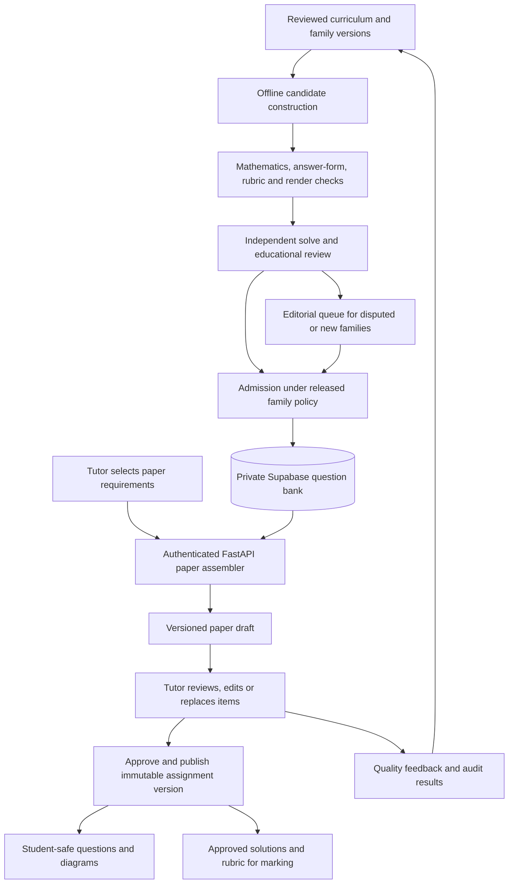

# Question-generation readiness review

Reviewed 13 September 2026. Scope: the independent root `question_generation/` package, its Supabase bank, and its fit with the proposed MethodMark application. The legacy `generation/` package is not the implementation assessed here.

**Verdict: a promising, constrained mathematics compiler with substantial engineering safeguards. It is not yet a demonstrated, reliable source of high-quality secondary mathematics papers, and there is no evidence supporting a state-of-the-art claim.** Preserve the deterministic core and durable admission workflow. The largest gaps are assessment validity, curriculum coverage, useful variety, independent educational evaluation, and application integration.

This review adds documentation and a reproducible diagnostic script. It does not change generation code, existing jobs, database contents, or model configuration. No paid inference was performed.

## Evidence gathered

Read the project proposal, the relevant use-case text in the binary Word document, both architecture/framework documents, the reference profile, validation history, and implementation and tests. Inspected the supplied Autodata paper and relevant examination/marking pages. Rendered and visually inspected a similarity student page and a quadratic-sequence marking page in memory.

| Check performed during this review | Result |
|---|---|
| Existing `pytest -q` suite | **243 passed, 31 skipped** |
| `ruff check --no-cache src tests` | Passed |
| Thorough compiler qualification | **1,368 instances**, 10 parser cases, zero reported failures |
| Source fingerprint | `3d7a746879293feaaa9af621cd0b38d0f4bb854540e628401597bd3d258df81a` |
| Dedicated Supabase integration suite | Not run: `QGEN_TEST_DATABASE_URL` is absent |
| Read-only live Supabase inspection | **One admitted `algebra_expansion` item** |
| Successful live job currently recorded | `sec2_smoke_001`: one admission, four successful calls, 15,105 tokens, US$0.0859365 |
| Other job currently recorded | `sec2_exam_001`: `provider_error`, zero admissions, ten-question shortfall |
| Current failed-job ledger | Five calls: two successful and three invalid; US$0.080446 recorded |
| Teacher/difficulty evidence in the live bank | `human_audit_status=not_performed`, `difficulty_status=estimated` |
| Live access controls | RLS enabled on all seven pipeline tables; `anon` and `authenticated` lack SELECT on those tables and the bank view |

The historical validation document describes earlier ledger snapshots, including a larger failed run. The figures above describe the database observed during this review; the reason for the difference was not established. Neither snapshot measures broad educational quality. The current ten-program job file uses `sec2_exam_002`, which was absent from the inspected job list.

Passing compiler tests establish behavior within the tested contracts. They do not independently establish that those contracts represent fair marking or that students benefit from the questions.

## Requirements traceability

The proposal calls for syllabus-aligned secondary mathematics, worked solutions, method and accuracy marks, Supabase persistence, and tutor control. Use Case 5 requires a reviewed draft, selected-question replacement, and storage of the approved paper/rubric. Use Case 6 permits publication only after review. Use Case 7 needs an approved rubric detailed enough to mark intermediate working.

The user's current offline-bank requirement changes the implementation of UC5's generation step: the backend should assemble previously generated items when the tutor clicks Generate. The review and publication requirements still apply.

| Requirement | Current implementation | Assessment |
|---|---|---|
| Syllabus-aligned secondary coverage | Ten programs; `Item` and `Job` hard-code Secondary 2, G3, mathematics | Narrow pilot only; no reviewed objective registry |
| Complete item package | Stem, linked parts, answers, solutions, criteria, diagrams, hashes and evidence | Strong foundation |
| Fair method/accuracy marking | M/A/B criteria and exact intermediate targets; limited follow-through | Concrete form/method defects; insufficient alternative-response coverage |
| Supabase question bank | Remote JSONB packages and atomic admission | Working live for one item |
| Generate a requested paper | Frontend timer selects local sample questions; backend only registers health | Missing |
| Replace selected questions | Sample-bank replacement exists in the browser | Missing real bank selection and exclusion logic |
| Review, approve and publish | Browser-local prototype state and assignment snapshots | Needs authenticated, persisted backend workflow |
| Reuse approved rubric for marking | Rich compiler package versus a flat frontend question type | Needs a versioned application contract |

Sources: [proposal](Project_Proposal.docx), [use cases](Use_Case_Model.doc), [domain contracts](../question_generation/src/question_generation/domain.py), [frontend types](../frontend/src/data.ts), [dashboard](../frontend/src/App.tsx), [API router](../backend/app/api/router.py).

## Findings, in priority order

### 1. Required answer forms are not enforced

**High priority; reproduced locally.** `equivalent()` validates algebraic or numeric equality, while most answer contracts do not encode the requested output form. Consequently:

| Generated instruction, seed 19 | Submitted answer | Current outcome |
|---|---|---|
| Expand and simplify `(7x+2)(x−8) − 6(x−1)` | The original unexpanded expression | Accepted |
| Express `7/(x+9) + 2/(x+2)` as a single fraction in simplest form | The original two fractions | Accepted |
| Give `sin ABC` as a fraction in simplest form | `0.6` or `6/10`, where the reference is `3/5` | Accepted |

These cases bypass the intended assessed skill. The supplied examination's marking material explicitly distinguishes a simplified trigonometric fraction from an unsimplified one. Factorisation already has a structural check; other required forms need equivalent treatment.

Add answer-form constraints separate from mathematical equivalence: expanded polynomial with collected terms, single reduced rational expression, reduced numerical fraction, decimal precision, and equation form. Preserve the submitted syntax for those checks. Apply them consistently in solver comparison, fixtures and marking. Do not impose a form that the student prompt does not require.

Locations: `mathematics.py:137`, `domain.py:30`, `programs.py:267`, `programs.py:297`, `programs.py:666`.

### 2. Rubrics can exclude valid methods, and their fixtures do not establish fairness

**High priority; reproduced locally.** The shortest-distance part of `right_triangle` says only to find the distance. Its rubric requires the `area` method. A correct trigonometric calculation, `altitude = AB × sin ABC`, is rejected by `check_solve()` because its method code is `trigonometry`.

The provider instructs models to use supplied method codes, so successful calls are biased toward satisfying the chosen rubric. That is not an independent search for all legitimate methods. Similarity-area marking also assumes a squared-scale-factor intermediate even though direct subtraction of triangle areas is a valid route.

`Draft.finish()` creates most alternative fixtures by adding `+ 0`; its slip fixture removes a final response step. These are useful software checks but do not exercise genuinely different derivations, realistic arithmetic slips, or a teacher's partial-credit decisions. There is a separate real follow-through test for grouped statistics, which is worth retaining.

Distinguish explicitly required methods from reference methods. Support alternative criterion paths without double-counting marks. Build independently reviewed response fixtures: alternative derivations, sign errors with preserved method credit, consequential errors, unsupported conclusions, invalid domain choices and wrong explanations. The structured checker is not currently a grader for arbitrary handwriting.

Locations: `programs.py:113`, `programs.py:175`, `programs.py:629`, `marking.py:7`, `verification.py:327`, `provider.py:299`.

### 3. Independent answers are checked more strongly than reasoning

**High priority; reproduced locally.** `check_solve()` accepts correct final answers accompanied by the sentence “This is unrelated working with no mathematical derivation.” It checks working length and a method label, without validating the derivation. This probe exercises that deterministic gate; it does not show that such a response would pass the separate examiner model.

The independent oracle checks answer and criterion targets. Compiler binding catches later edits to worked solutions, but reproducing the compiler's prose is not a proof that the prose itself is sufficient or correct. Free-form explanatory correctness ultimately depends on model review.

The generated sequence marking page illustrates another quality issue: after forming `3n²+n+5=159`, it jumps to `n=7` without showing factorisation or root selection. The result is correct, but this is a weak worked solution for a learner.

Represent supported derivations as checked steps with domains and justifications, then render readable school-level working from them. Check submitted structured reasoning where feasible, and record unresolved prose/proof claims explicitly. Keep independent model review for clarity and unsupported reasoning, with teacher escalation for disputed cases.

Locations: `verification.py:214`, `verification.py:327`, `programs.py:460`, `mathematics.py:142`.

### 4. Curriculum and variety are too limited for the intended product

**High priority; capacity measured locally.** The planner chooses one of six previews of existing constructors. It cannot change the mathematical structure, wording, scaffolding or rubric. This can supply useful routine practice, but adding stronger models will not enlarge the design space.

`right_triangle` selects three fixed Pythagorean triples and seven scales. Its entire supported space is **21 mathematical instances**; compiling 900 seed/variant combinations reproduced exactly 21 identities. Once these are admitted or suspended, exact deduplication prevents further new stock from that program. `similar_triangles` ignores the variant argument; variants 0 and 2 at the same seed produce the same student question and identity. Quadratic sequences also retain one fixed question structure.

Curriculum metadata consists of a profile label and free-text objectives, not a reviewed mapping to versioned syllabus clauses and prerequisites. The application offers Secondary 1–4 and Elementary/Additional Mathematics, while generation is fixed to Secondary 2 G3 mathematics. Broad coverage and A-Math must not be inferred from the current catalogue.

Create a curriculum registry with stable objective IDs, source references, course/year eligibility, prerequisites, permitted methods and calculator conventions. Add reviewed families across the intended launch scope. Vary unknowns, representations, scaffolding and linked skills as well as parameters. Preserve routine exercises as a deliberate category. Introduce structural similarity clusters and paper-level repetition limits; exact hashes alone do not control near-duplicates.

Locations: `domain.py:96`, `domain.py:164`, `planning.py:8`, `programs.py:34`, `programs.py:566`, `programs.py:629`.

### 5. Educational release decisions and a trustworthy benchmark are missing

**High priority; confirmed in code and live evidence.** Admission requires model review but no recorded educational qualification of the family. The bank honestly records that teacher audit has not occurred. There is no empirical difficulty calibration, blinded tutor benchmark or measured defect rate across topics. Two model vendors reduce some shared failure modes; they do not provide independent human validation.

The learning loop selects variants using admission outcomes and repeated compiler checks. It does not measure improved student suitability, promote new families, or test recipe improvement on a sealed teacher-labelled holdout. Some variants are identical, so even its adaptation can have little educational effect.

Introduce separate family release and item review records. Start with teacher-reviewed draft use. Permit unattended bank admission for a family/version only after predefined evaluation criteria are met. Continue random and targeted audits. A family defect should prevent future selection of affected items and identify affected paper drafts; existing assignments require an explicit correction/versioning policy.

Locations: `admission.py:18`, `admission.py:86`, `evaluation.py:35`, `evaluation.py:93`, `storage.py:545`.

### 6. Paper assembly and the application data contract are absent

**Required for the requested user flow.** The backend has only health routes. `App.tsx:167` calls `makeQuestions()` after a timer. There is no request that retrieves eligible Supabase bank entries or balances a paper's marks, duration, topic distribution and difficulty.

The frontend `Question` type has one text string, one solution string, and two mark totals. It cannot faithfully represent linked parts, B marks, criterion dependencies, follow-through or geometry. Do not flatten these away when integrating the bank.

Build a server-side paper assembler with explicit constraints and persisted item versions. Selected-question replacement must preserve accepted items and exclude inappropriate duplicates. If stock cannot meet the request, preserve the request and report the unmet constraints; do not silently substitute another level or repeat the same item.

Locations: `backend/app/api/router.py`, `frontend/src/App.tsx:167`, `frontend/src/data.ts:2`, `frontend/src/data.ts:35`, `storage.py:545`.

### 7. Rendering and operational verification need expansion

The two inspected pages were readable and the similarity diagram was present and labelled. Current deterministic layout checks establish page fit, text presence and image presence. They do not establish label separation or the readability of every mathematical expression. The examiner receives the student PNG and structured solutions/rubric; it does not visually inspect the rendered marking page.

Keep in-memory rendering and add marking-page visual review, supported mathematical typesetting and boundary-case diagram checks. Reflow at assembled-paper level and verify that solutions cannot leak into student delivery.

The live database permissions are appropriately restrictive for the current worker. Keep the answer-bearing bank view private. Application integration needs authenticated tutor access and a student projection through the backend, with diagrams regenerated without returning construction coordinates or answer metadata. Run the 31 dedicated Supabase tests before production claims about concurrency, recovery and permissions. Add targeted retrieval indexes and metadata queries as the bank grows; `bank()` currently loads entire packages and evidence for all admitted items.

Locations: `rendering.py:102`, `rendering.py:155`, `provider.py:305`, `provider.py:513`, `storage.py:89`, `storage.py:545`.

## Recommended architecture



The Generate click should normally perform a bank query and constrained selection. Offline workers replenish stock separately. This separates generation latency and provider failures from ordinary tutor interaction.

Proposed API contracts:

- `GET /api/v1/curriculum`: available, released objectives and supported paper options.
- `POST /api/v1/papers/generate`: course/year, objective IDs, question/mark targets, duration, demand mix, calculator policy and exclusions; return a persisted draft or explicit stock shortfall. Use an idempotency key for retries.
- `POST /api/v1/papers/{id}/replace`: replace selected items while retaining the rest and the paper constraints.
- Approve/publish operations: enforce tutor ownership, complete packages and review of the exact saved version. Edits invalidate prior approval.
- Student access: serve only the published question projection and rendered figures. Keep answers and criteria behind authorised tutor/marking access.

Retain the existing immutable package and evidence chain. Add curriculum and family release records, teacher audit/issue records, semantic cluster IDs, separate estimated/calibrated difficulty metadata, and application paper/version/item tables. Store criterion-level rubric data, including B marks, instead of reducing everything to two totals. Snapshot approved question/rubric versions so later bank changes do not silently change published work.

The selection service should apply hard eligibility filters first, then choose a feasible set with topic/skill coverage, marks, time, difficulty mix and repetition limits. Keep linked subparts together. Use deterministic seeded selection and a recorded selection policy for reproducibility. Track exposure per tutor/class if avoiding repeated practice is required. Return a useful shortfall when constraints conflict.

## What would justify stronger quality claims

Create an evaluation suite with authentic tutor decisions, split by mathematical family and source. Keep a final audit set outside prompt/recipe optimisation. Include both valid items and plausible defects: ambiguous givens, wrong domains, incomplete solutions, invalid method restrictions, unfair follow-through, incorrect precision and misleading diagrams.

Compare the current pipeline with a simple verified-template baseline and a constrained LLM-authoring baseline under the same budget and curriculum requests. Measure each stage's contribution, including whether the paid planner adds value over deterministic sampling. Evaluate actual outputs blindly with tutors; do not let the production examiner model be the sole benchmark judge.

Report separately by family and demand level: mathematical defects, ambiguous/unsolvable items, rubric errors, teacher acceptance without substantive editing, curriculum fit, variety, generation shortfalls, false rejections, latency and cost per teacher-accepted item. Set sample sizes and release thresholds before evaluating. Account for correlated numerical variants when estimating uncertainty.

Student response data can later support difficulty, completion-time and discrimination estimates. Until enough appropriate data exist, label difficulty as estimated. A model solve gap is not a student difficulty scale.

Recent research supports these components, without certifying this implementation:

- [EQPR, ACL 2025](https://aclanthology.org/2025.acl-long.628/) combines educational objectives, planning and iterative evaluation. The applicable idea is explicit educational planning and measured alignment; the current six-preview selector implements only a small part of that design space.
- [VeriGeo, June 2026 preprint](https://arxiv.org/abs/2606.14176) connects geometry statements, diagrams and proof steps through executable representations and multiple verification stages. It supports extending the present geometry contracts, but its reported solver-training results do not establish Singapore classroom quality.
- [Autodata v3](https://arxiv.org/abs/2606.25996v3), also supplied locally, studies agentic synthetic-data creation and improvement for model training/evaluation. Its objective needs adaptation to students and tutors; its published performance is not an expected acceptance rate for MethodMark.
- [EQGBench](https://arxiv.org/abs/2508.10005) separates educational question generation from mathematical answering and evaluates multiple educational dimensions. Its Chinese multi-subject setting requires a local curriculum and teacher benchmark before transferring conclusions.

These are relevant research references, not an exhaustive ranking of all systems as of the review date. The current official syllabus PDFs could not be fully retrieved through browsing (MOE challenge page; the searched SEAB PDF URL returned 404). Full current syllabus alignment was therefore not verified. Obtain and review the applicable official version before releasing new curriculum profiles.

## Implementation order and completion criteria

| Order | Deliverable | Evidence of completion |
|---|---|---|
| 1 | Correct current assessment contracts | Reproduced form/method defects fixed; independently specified alternative-method and partial-credit cases pass; supported worked solutions show the essential steps |
| 2 | Teacher qualification and explicit launch scope | Reviewed curriculum IDs and family versions; recorded audits and release decisions; unavailable levels/topics excluded from supported options |
| 3 | Expand bank and validate live generation | Multi-topic runs across seeds/variants; honest admission/shortfall/cost reports; dedicated Supabase integration tests pass; teacher quality measured separately |
| 4 | Connect backend and frontend | Generate/replacement produces persisted constrained drafts from Supabase; exact-version approval and immutable publication; safe student output; shortage and retry behavior verified |
| 5 | Broaden and optimise | New families and representations qualified; structural diversity measured; difficulty calibrated when response data permit; recipe/model changes beat defined baselines on held-out evaluation |

The present system is suitable for continued engineering development and closely reviewed Secondary 2 pilot material. The immediate recommendation is to repair and evaluate the assessment contracts, then connect a constrained bank-backed paper workflow. Calling it state of the art should follow comparative educational evidence.

## Reproduce the local probes

From the repository root:

```powershell
question_generation/.venv/Scripts/python.exe docs/review_question_generation.py
```

The script only compiles examples in memory and prints observations. It makes no database connections, model requests or generated-file exports. `accepted: true` in the answer-form examples and an empty issue list for unrelated working describe the defects observed in the reviewed version; they are not expected production behavior.
